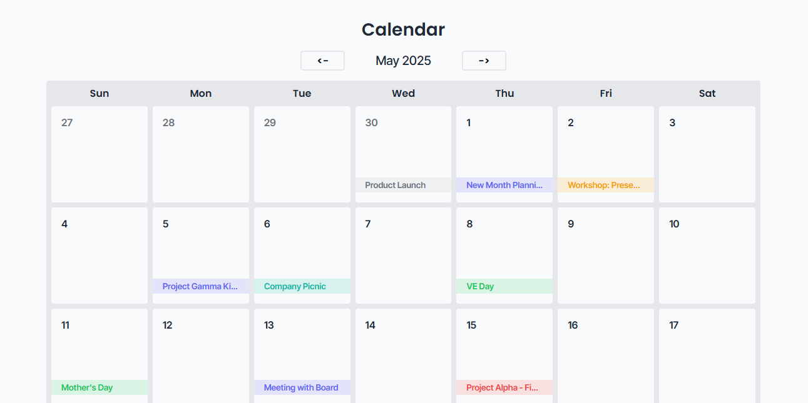

# Event Calendar
Present events from a JSON file onto a rendered calendar using templates and partials

## Tools
Handlebar.JS
HTML, CSS, JS

## How
- Main.js initally fetches event data from data.json and the current date
- Then we use a array, day, to store the days of the current display months
- After we add the events to the days by filtering the data from last month, current month, and next month 
- Lastly, we render the calendar using the day array into calendar_template
- Each time a action button is pressed with repeat steps 2-4.


## Sample data
```
    {
        "month": "December 2024",
        "days": [
            {
                "date": 2,
                "events": [
                    {
                        "title": "Marketing Strategy Workshop",
                        "type": "Workshop"
                    },
                    {
                        "title": "Team Lunch",
                        "type": "Social"
                    }
                ]
            },
        ]
    }
```

## Structure
```
/Task_Dashboard
│
├── index.html          # Main HTML file with template placeholder
├── style.css           # Styling
├── main.js             # JS logic: fetch, compile, render
├── data.json           # JSON with data
├── /screenshot         # Contains screenshot of the mini-project
```