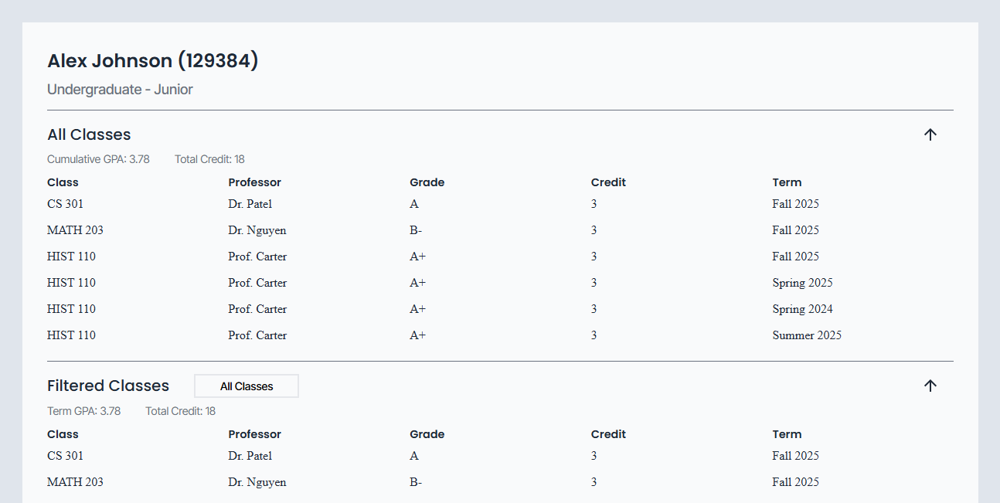

# Student Gradebook Viewer
A Single page gradebook for a student

## Tools
Handlebar.JS
HTML, CSS, JS

## How
- Main.js initally fetches student data from data.json
- Then we load the students info, all classes, and a default intial call to filter classes through there respective methods into the template for rendering and compiling.
- Filtering occurs through a custom made drop down menu that calls updateFilterClasses() at each selection, which reloads the display.

## Handlebar Helpers
- class : Format department and class_number into "(department) (number)"
- letterGrade : Covert number grade into corresponding letter grade
- totalCredit : Gets total credit of all passed in classes
- calculate : Calculate total GPA of all passed in classes

## Handlebar Partials
- Class : Display all class information
- ClassInfo : Display total statistics of all passed in classes

## Helper Methods
- addEventsToFilter : Add Event listener to filter menu items
- startUp : calls fetch data and initalize grade_map
- fetchData : Fetch student data from local file
- loadStudentInfo : Load the students information
- loadFilterMenu : Load the filter menu in semester year order
- loadAllClasses : Load the filter menu, load all course data, and load all the actual course information
- loadData : Load pass in data to a given template and its container
- updateFilterClasses : Filter classes based on selected filter and load all the filter class information
- convertToLetterGrade : Convert number grade to letter grade
- getTotalCredit : Get total credit of passed in classes 
- getGradeAndCredit : Get object form {grade, credit} of passed in classes
- errorHandler : central error handler

## Sample data
```
    {
        "name": "Alex Johnson",
        "id": 129384,
        "status": "Undergraduate",
        "year": "Junior",
        "classes": [
            {
                "semester": "Fall 2025",
                "department": "CS",
                "classNumber": 301,
                "professor": "Dr. Patel",
                "grade": 94,
                "credit" : 3
            },
        ]
    }
```

## Structure
```
/Task_Dashboard
│
├── index.html          # Main HTML file with template placeholder
├── style.css           # Styling
├── main.js             # JS logic: fetch, compile, render, and helpers
├── data.json           # JSON with data
├── /screenshot         # Contains screenshot of the mini-project
├── /assets             # Contains svg of drop-down menu icons
```