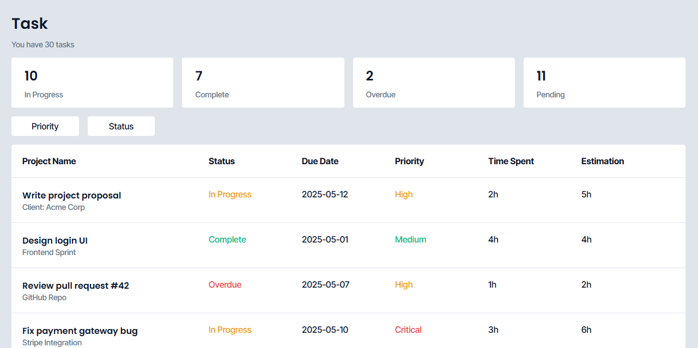

# Task Dashbaord
Present data from a JSON file in a dashboard enviroment containing statistics, filtering, and task

## Tools
Handlebar.JS
HTML, CSS, JS

## How
- Main.js initally fetches task data from data.json
- It then compiles data into 3 templates (info_template, total_template, task_template).
- Each template updates and filters data based on specfic constraints
    - info_template: Gather all statistics across all task
    - total_template: Gather total amount of task
    - task_template: Filter data based on priority and status filters
- Lastly, injects the rendered HTML into their respective containers (info_container, total_container, task_container)

## Sample data
```
{
    "title": "Design login UI",
    "subtitle": "Frontend Sprint",
    "status": "complete",
    "due_date": "2025-05-01",
    "priority": "medium",
    "time_spent": "4h",
    "time_estimation": "4h"
}
```

## Structure
```
/Task_Dashboard
│
├── index.html          # Main HTML file with template placeholder
├── style.css           # Styling
├── main.js             # JS logic: fetch, compile, render
├── data.json           # JSON with data
├── /screenshot         # Contains screenshot of the mini-project
```